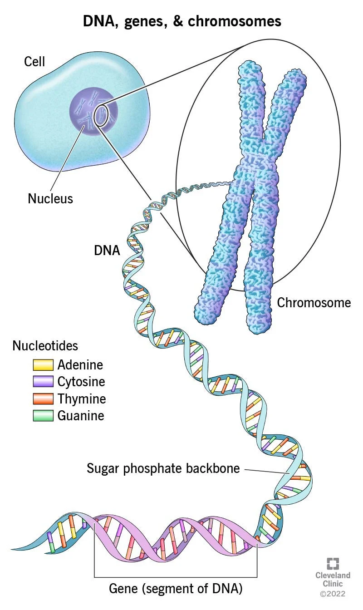
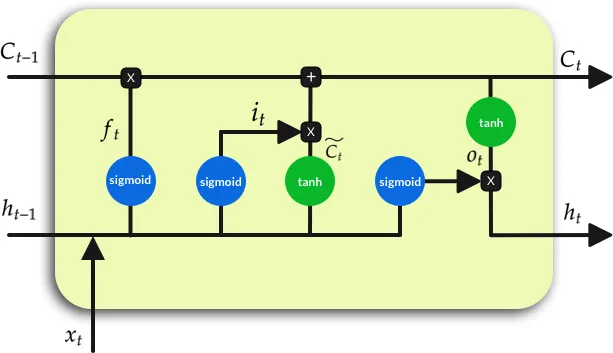

Genome Annotation using BiLSTM
==============

**Author:** *Johnathan Lomas*

**Date:** *5/15/23*

---

# Introduction

## Genomes, Chromosomes, and Gene Annotation

The genomes of multicellular organisms are composed of long polymers composed of four nucleotides (ATGC...). Each distinct polymer is called a chromosome (Figure 1). Within each chromosome, specific regions comprise protein-coding genes which represent the primary building blocks of the organisms biology. Genes are also composed of distinct structural elements within the sequence that perform a variety of important tasks. Thus, a foundational task in the study of any organsim is to identify the sequences of each of the genes in its genome.


<figure align="left" display="inline-block">
  
  <figcaption text-align="center">Figure 1. Genome to Gene</figcaption>
</figure>


Within the last 20 years, new technology has allowed biologists to obtain the complete genome sequence of many organisms. Each newly sequenced genome is represented by long (3.2 billion in humans) stretches of A|T|G|C sequences and the question that arises is: where are the genes? Thus, the goal of 'genome annotation' procedures is to identify the location of every gene in the genome using chromosome specific coordinates.

## Bi-directional Long Short Term Memory (BiLSTM)

The BiLSTM neural network architecture is a popular method for working with sequences (i.e. data in which the order is impotant). It is based on Recurrent Neural Networks (RNNs) in which the model output relies on both information from the current input and the model state induced by the previous data point. While RNNs represent a significant archetictural improvment for analyzing sequential data, they often suffer from exploding/vanishing gradient problems. Additionally, information learned along the sequence is heavily localized, limiting the model's ability to 'remember' useful information from distant portions of the sequence.

The LSTM archeticture aims to solve the above issues by introducing informational gates (Figure 2). These include, the forget gate (f), the input gate (i), and the output gate (o). Each of these gates contribute to the cell (C) and hidden (H) states which are passed to the next cell. The LSTM can be constructed bi-directionally by stacking two LSTM cells, each working in the opposite direction along the sequence. This is ideal for the analysis of DNA because genes can be encoded in either direction.

#### Figure 2. LSTM Cell



## Goal

The goal of this project is to use the bi-directional long short term memory neural network architecture to predict the location of gene features directly from the DNA sequence. Thus, the model will assign one of four classes - including: Coding, Intron, UTR, and Intergenic - to each base of an input DNA sequence.

---

# Methods

## Data Type and Size

For training and testing a BiLSTM genome annotation model, I used genomic information from the model plant species *Arabidposis thaliana*. The genomic data for *Arabidopsis* can be downloaded from [The Arabidopsis Information Resource (TAIR)](https://www.arabidopsis.org/download/index-auto.jsp?dir=%2Fdownload_files%2FGenes%2FTAIR10_genome_release). The necessary information comes in two separate files. A FASTA file contains the actual DNA sequence and a gene feature file (GFF) contains the chromosome coordinates of each gene feature.

#### Example Fasta File
```
>Chr1
ATGCATGCTATGCTAGT......
>Chr1
 ATGCATGCTATGCTAGT......
```
#### Top of GFF for *Arabidopsis* Chromosome 4
Columns four and five provide the start and end coordinates for the gene feature held in column three.
```
Chr4	phytozome9_0	gene	1180	1536	ID=AT4G00005
Chr4	phytozome9_0	mRNA	1180	1536	ID=PAC:19645541
Chr4	phytozome9_0	exon	1180	1536	ID=PAC:19645541.exon.1
Chr4	phytozome9_0	CDS	    1180	1536	ID=PAC:19645541.CDS.1
Chr4	phytozome9_0	gene	2895	10455	ID=AT4G00020
Chr4	phytozome9_0	mRNA	2895	10364	ID=PAC:19647157
Chr4	phytozome9_0	exon	2895	3022	ID=PAC:19647157.exon.22
Chr4	phytozome9_0	exon	4127	4149	ID=PAC:19647157.exon.21
Chr4	phytozome9_0	exon	4227	4438	ID=PAC:19647157.exon.20
Chr4	phytozome9_0	exon	4545	4749	ID=PAC:19647157.exon.19
```
The full fasta file for the *Arabidopsis* genome is 116 Mb and contains seven chromosomes. This includes 119 million bases and an average chromosome length of ~17 million. The complete *Arabidopsis* annotation file (GFF) is 34 Mb and contains 27,416 distinct gene features.
```
# Summary statistics for the Arabidopsis genome fasta file

num_seqs  sum_len         min_len     avg_len        max_len
7         119,667,750     154,478     17,095,392.9   30,427,671
``` 

Due to problems with computational efficiency in loading the training data, I reduced the size of the training set to a 100,000 base-pair sequence randomly selected from Chromosome 4 (more on that below).

## Data Loading 

For input into the model,  DNA sequences are one-hot encoded to produce a 4X(seq_len) matrix. Class labels were encoded numerically as below:
- Coding: 0
- Intron: 1
- UTR: 2
- Intergenic 3 

While designing and training the model, I found that the data loading process was the primary limitation on training speed. This was likely due to the complexity of the mapping task in which GFF derived start and end coordinates were used to label the dna sequence on-the-fly. To reduce the computational burden associated with this task, I pre-computed the per-base classes across the entire training sequence and storedin fasta format. Thus, the input to the data loading routine is two fasta format files where one contains the DNA sequence and one contains the class label sequence.

```
>Input DNA
ATGTCGATATATGTTTTGCTACGATCAGTACAACACCAAAC...

>Input classes
33333333222222200000000000000111111100000...
```

While this data loading scheme was fast enough to permit reasonable training times for my small training set, it still does not scale well as the length of the training sequences increases. Therefore, future work should aim to further serialize the data loading process in order to train the model on significantly more data.

## Model Architecture and Training

The final model architecture included a BiLSTM neural network with with four layers, a hidden unit size of 20, and a total of 35,844 paramters. The model outputs the four class probabilites from each LSTM cell to produce an output sequence that is the same length as the input. This architecture was chosen based on a similar model built for genome annotation (Stiehler et. al). Unfortunately, I did not have time to investigate other differently sized models. Thus, improvments in model accuracy may be gained by comparing differently sized models using cross validation. 

Following the method of Stiehler, the model was trained on short 20 base pair length sequences extracted at random from the full 100,000 base pair training sequence. An epoch consisted of a complete training cycle through all possible 20 base pair sequences from the training set. The ADAM optimizer was used with the Cross Entropy Loss function to train the model for 500 epochs using a learning rate of 0.01.

To enhance the speed of training, I used the ```DistributedDataParallel``` module from ```torch.nn.parallel``` to parallelize the training routine using UNRs high performance computing (HPC) cluster. The final model was trained on two computing nodes running 13 processes each, for a total of 26 subprocesses. With this configuration, each epoch completed in ~10 seconds and the full 500 epochs completed in ~1.5 hours. 

---

# Results

## Model Testing

The model was tested on the original training sequence and five randomly selected 100,000 base pair sequences from Chromosome 4. In each case, the entire 100,000 base pair sequence was input directly to the model in a single batch. The total and class-wise prediction accuracies are presented below.


The model performs far better on the training sequence than on any other sequence tested, indicating that the model is overfit to the training set. This is likely due to the small size of the training sequence, which may not adequately reflect the genetic diversity of the entire chromosome. Interestingly, the model performed very well in predictiong intronic bases in the test sequences relative to the training sequence. This may reflect intron-specific sequence patterns that are common over the entire chromosome. Also of note is the very poor performance in predicting UTR regions. This may indicate a high degree of sequence diveristy for UTR regions across the chromosome.

---

# Discussion and Future Directions 

During this project, the computational constraints of my data loading method limited the amount of data that I could reasonably use for training. Thus, the model was trained on a very limited portion of the *Arabidopsis* genome which likely caused severe overfitting. This overfitting can be observed in the significantly higher predictive accuracy on the training sequence compared to all the other test sequences. This can be improved by further serializing the DNA and label datasets in order to increase data loader efficiency, thereby permitting the use of larger training sets. Additionally, only a single model size was tested with repect to the number of hidden units and LSTM layers. Significant improvmenents may be realized by testing models with alternative configurations.

---
# Code

GitHub: [https://github.com/jlomasunr/DeepGenomeAnnotation](https://github.com/jlomasunr/DeepGenomeAnnotation)

#### DGA.py: Primary script for model training and testing
```
import sys, os, time, argparse, torch
from Bio import SeqIO
import numpy as np
import pandas as pd
from torch.utils.data import Dataset, DataLoader, distributed
import torch.nn as nn
import torch.nn.functional as F
import torch.optim as optim
from torch.autograd import Variable
from itertools import islice
from socket import gethostname

# Custom dataset class for extracting one-hot-encoded dna sequences and basewise classes
class GenomeData(Dataset):
	def __init__(self, fasta_path, class_path, window):
		# Expects the gff to contain at least the following features ('gene','five_prime_UTR','CDS','intron','three_prime_UTR')
		# NOTE: AGAT can be used to add introns (agat_sp_add_introns.pl --gff [] --out [])
		# NOTE: The gff should also be reduced to a single transcripts (agat_sp_keep_longest_isoform.pl -gff [] -o [])
		self.fasta_path = fasta_path
		self.class_path = class_path
		self.feature_list = ('five_prime_UTR','CDS','intron','three_prime_UTR')
		self.class_map = {
			"CDS": 0,
			"intron": 1,
			"five_prime_UTR": 2,
			"three_prime_UTR": 2,
			"intergenic": 3
			}
		
		self.window = window
		self.seq_map = dict(zip("ACGTRYSWKMBDHVN", range(15)))
		
		self.total_length = 0
		self.chr_lengths = [0]
		for record in SeqIO.parse(fasta_path, "fasta"):
			self.chr_lengths.append(len(record) + self.total_length)
			self.total_length += len(record)
		del record

	def __len__(self):
		return self.total_length - self.window
	
	def __getitem__(self, idx):
		# Get the chromosome sequence corresponding to the index
		# Then update the index to chromosome coordinates
		seqs = SeqIO.parse(self.fasta_path, "fasta")
		clss = SeqIO.parse(self.class_path, "fasta")
		chr_bool = [idx < chr_idx for chr_idx in self.chr_lengths]
		for i in range(1,len(chr_bool)):
			if chr_bool[i] and not chr_bool[i-1]:
				seq_record = next(islice(seqs, i-1, None))
				cls_record = next(islice(clss, i-1, None))
				idx -= self.chr_lengths[i-1]
				if idx + self.window > len(seq_record):
					idx = len(seq_record) - self.window
				break
		del seqs
		del clss
		
		# Extract the dna and class sequences from the chromosome according to the
		# index and the window length. Then convert to a one-hot-encoded tensor
		end_idx = idx+self.window
		sequence_onehot = torch.Tensor(np.eye(15)[[self.seq_map[i] for i in seq_record[idx+1:end_idx+1].seq]])
		class_seq = cls_record[idx+1:end_idx+1].seq
		classes = torch.Tensor(torch.tensor([int(i) for i in class_seq])).type(torch.LongTensor)
		del seq_record
		del cls_record
		
		return sequence_onehot, classes


class biLSTM(nn.Module):
	def __init__(self, hidden_size, num_layers, dropout=0.2):
		super(biLSTM, self).__init__()
		self.num_classes = 4 # number of classes to predict
		self.input_size = 15 # number of features for each input vector
		self.num_layers = num_layers # number of LSTM layers
		self.hidden_size = hidden_size #LSTM hidden state
		
		if num_layers > 1:
			self.dropout = dropout
		else:
			self.dropout = 0

		self.lstm = nn.LSTM(input_size=self.input_size, 
							hidden_size=self.hidden_size,
							num_layers=self.num_layers, 
							batch_first=False,
							bidirectional=True,
							dropout = self.dropout)
		self.fc = nn.Linear(2*self.hidden_size, self.num_classes) # Final layer from hidden state to output

	def forward(self, sequence):
		#h_init = Variable(torch.zeros(2*self.num_layers, self.hidden_size, 1)) # Hidden state
		#c_init = Variable(torch.zeros(2*self.num_layers, self.hidden_size, 1)) # Internal state
		out, _ = self.lstm(sequence) # LSTM with input, hidden, and internal state
		out = self.fc(out)
		return out

def trainBiLSTM(model, data_loader, num_epochs, learning_rate, device, outfile):

	objective = nn.CrossEntropyLoss()
	optimizer = optim.Adam(model.parameters(), lr=learning_rate)
	
	epochstart = time.time()
	for epoch in range(num_epochs):
		loss_trn = 0.0
		i = 0
		for sequence, labels in data_loader:
			sequence = sequence.permute(1,0,2).to(device)
			labels = labels.to(device)
			
			outputs = model(sequence) # Forward pass	
			loss = objective(outputs.permute(1,2,0), labels) # Compute loss
			optimizer.zero_grad() # Reset gradients 
			loss.backward() # Compute gradients
			optimizer.step() # Update parameters via backpropagation
			loss_trn += loss.item()
			i += 1

		#if (epoch == 0) | (epoch % 10 == 0):
		if rank == 0:
			print(f"Epoch: {epoch}, loss: {loss_trn/len(data_loader)}... {time.time() - epochstart}", file=sys.stderr)
			torch.save(model.module.state_dict(), outfile) 

def testBiLSTM(model, seq, labels):
	model.eval()
	pred_stats = {
		"Overall":{"total":0, "correct":0, "percent":0},
		0:{"class":"CDS", "total":0, "correct":0, "percent":0},
		1:{"class":"Intron", "total":0, "correct":0, "percent":0},
		2:{"class":"UTR","total":0, "correct":0, "percent":0},
		3:{"class":"Intergenic","total":0, "correct":0, "percent":0 },
	}

	with torch.no_grad():
		outputs = model(seq)
		_, predicted = torch.max(outputs, dim=1)
		pred_stats["Overall"]["total"] = labels.size()[0]
		pred_stats["Overall"]["correct"] = int((predicted == labels).sum())
		pred_stats["Overall"]["percent"] = (pred_stats["Overall"]["correct"]/pred_stats["Overall"]["total"])*100
	for i in range(len(labels)):
		pred_stats[labels[i].item()]["total"] += 1
		if predicted[i].item() == labels[i].item():
			pred_stats[labels[i].item()]["correct"] += 1
	
	for i in range(4):
		pred_stats[i]["percent"] = (pred_stats[i]["correct"]/pred_stats[i]["total"])*100
	
	return pred_stats 

def trainModel(fasta, gff, lstm_model=None, window=20, lr=0.1, epochs=100, hidden=10, layers=1, outfile="model_state.pt",batch_size=1, seed=123, num_workers=0, pin_memory=True):
	torch.manual_seed(seed)
	device = torch.device("cuda:0" if torch.cuda.is_available() else "cpu")
	
	train_dat = GenomeData(fasta, gff, window)
	trainSampler = distributed.DistributedSampler(train_dat, num_replicas=world_size, rank=rank)
	
	if lstm_model:
		lstm_model.load_state_dict(torch.load("lstm_state.pt")) # needs map_location...
	else:
		lstm_model = biLSTM(hidden, layers)
	
	if torch.cuda.device_count() >= 1:
		torch.distributed.init_process_group(backend='nccl', rank=rank, world_size=world_size)
		local_rank = rank - gpus_per_node * (rank // gpus_per_node)
		torch.cuda.set_device(local_rank)
		lstm_model = nn.parallel.DistributedDataParallel(lstm_model.to(local_rank), 
							device_ids=[local_rank],
							gradient_as_bucket_view=True)
		trainLoader  = DataLoader(train_dat, 
						batch_size=batch_size, 
						sampler=trainSampler,
						num_workers=int(os.environ["SLURM_CPUS_PER_TASK"]), 
						pin_memory=pin_memory)
		
		print(f"Beginning training on cuda {local_rank}.")
		trainBiLSTM(lstm_model, trainLoader, epochs, lr, local_rank, outfile)
	else:
		torch.distributed.init_process_group(backend='gloo', rank=rank, world_size=world_size)
		local_rank = rank - cpus_per_node * (rank // cpus_per_node)
		torch.device(local_rank)
		lstm_ddp = nn.parallel.DistributedDataParallel(lstm_model, device_ids=None, output_device=None, gradient_as_bucket_view=True)
		trainLoader  = DataLoader(train_dat, 
						batch_size=batch_size, 
						sampler=trainSampler,
						num_workers=num_workers, 
						pin_memory=pin_memory)

		print(f"Beginning training on {device} with rank {rank}.")
		trainBiLSTM(lstm_ddp, trainLoader, epochs, lr, device, outfile)
	
	torch.distributed.destroy_process_group()

if __name__ == '__main__':
	ap = argparse.ArgumentParser()
	ap.add_argument('action', type=str, help="[train|test] : Action to take")
	ap.add_argument("fasta", type=str, help="Fasta file")
	ap.add_argument('labels', type=str, help="Labels fasta file")
	ap.add_argument('--window', default=20, type=int, help="Window size for lstm")
	ap.add_argument('--hidden', default=10, type=int, help='Number of hidden units for lstm')
	ap.add_argument('--layers', default=1, type=int, help='Number of lstm layers')
	ap.add_argument('--outfile', default="model_state.pt", type=str, help="File to save model sate to")
	ap.add_argument('--batchsize', default=1, type=int, help="Batch size for data loader")
	ap.add_argument('--seed', default=123, type=int, help="Random seed for torch")
	ap.add_argument('--workers', default=0, type=int, help="Number of subprocesses for data loading")
	ap.add_argument('--model', default=None ,type=str, help="Model state_dict")
	ap.add_argument('--lr', default=0.1, type=float, help="Learning rate")
	ap.add_argument('--epochs', default=100, type=int, help="Number of training epochs")
	ap.add_argument('--nocuda', action='store_true', help="CPU only")
	args = ap.parse_args()

	if args.action == 'train':

		rank          = int(os.environ["SLURM_PROCID"])
		world_size    = int(os.environ["WORLD_SIZE"])
		cpus_per_node = int(os.environ["SLURM_CPUS_ON_NODE"])
		

		if not args.nocuda:
			gpus_per_node = int(os.environ["SLURM_GPUS_ON_NODE"])
			assert gpus_per_node == torch.cuda.device_count()
			print(f"Hello from rank {rank} of {world_size} on {gethostname()} where there are" \
			  f" {gpus_per_node} allocated GPUs per node and {cpus_per_node} CPUs per node.", flush=True)
		else:
			print(f"Hello from rank {rank} of {world_size} on {gethostname()} where there are" \
                          f" {cpus_per_node} CPUs per node.", flush=True)
		
		trainModel(args.fasta, 
			args.labels, 
			window=args.window, 
			hidden=args.hidden, 
			layers=args.layers, 
			outfile=args.outfile,
			batch_size=args.batchsize, 
			seed=args.seed, 
			num_workers=args.workers, 
			pin_memory=True,
			lr=args.lr,
			epochs=args.epochs,
			lstm_model=args.model)

	if args.action == 'test':
		# Requires: fasta, labels, --hidden, --layers, --model, --window
		lstm_model = biLSTM(args.hidden, args.layers)
		lstm_model.load_state_dict(torch.load(args.model))

		test_dat = GenomeData(args.fasta, args.labels, args.window)
		(seq, labels) = test_dat.__getitem__(0)
		test = testBiLSTM(lstm_model, seq, labels)
		print(test)

```

#### ConvertClasses.py: Script to generate per-base labels given a fasta and GFF
```
from Bio import SeqIO
import pandas as pd

class_map = {
			"CDS": "0",
			"intron": "1",
			"five_prime_UTR": "2",
			"three_prime_UTR": "2",
			"intergenic": "3"
			}
gff = pd.read_csv("Ath_Test.gff", sep="\t", usecols=[0,2,3,4], names=["chr","feature", "start","end"], comment="#")
gff = gff.loc[gff["feature"].isin(class_map.keys())]
gff.loc[gff["start"] > gff["end"], ('start','end')] = (gff.loc[gff["start"] > gff["end"], ('start','end')].values)

open('BaseWiseClasses.fa', 'w').close()
for record in SeqIO.parse("Ath_Test.fa", "fasta"):
	chromosome = record.id.split(" ")[0]
	record.seq  = "3"*len(record)
	chr_gff = gff.loc[gff["chr"]==chromosome]
	for index, row in chr_gff.iterrows():
		start = int(row["start"])
		end = int(row["end"])
		feat = class_map[row["feature"]]
		record.seq = record.seq[0:start-1] + feat*((end-start)+1) + record.seq[end:]
	record.description  = "Base-wise feature classes"
	with open("BaseWiseClasses.fa", "a") as out:
		out.write(f">{record.id} | {record.description}\n")
		out.write(record.seq + "\n\n")
```

#### splitSeqs.py: Script for extracting sub-sequences from fasta files
```
from Bio import SeqIO
import sys
import math

file = sys.argv[1]
length = int(sys.argv[2])

for record in SeqIO.parse(file, "fasta"):
    num_seqs = math.floor(len(record)/length)
    for i in range(num_seqs):
        print(f">{record.id} | part {i+1}:{(length*i)+1}:{length*(i+1)+1}")
        print(record[length*i:length*(i+1)].seq)
    print(f">{record.id} | part {i+1}:")
    print(record[(length*i)+1:].seq)
```
#### train_bilstm_cpu.sh: Slurm script for distributed cpu-only training on the HPC cluster
```
#!/bin/bash
#SBATCH --job-name=train_bilstm_cpu     # create a short name for your job
#SBATCH --nodes=2                       # node count
#SBATCH --ntasks-per-node=13             # total number of tasks per node
#SBATCH --cpus-per-task=4               # cpu-cores per task (>1 if multi-threaded tasks)
#SBATCH --mem=208G                       # total memory per node (4 GB per cpu-core is default)
#SBATCH --time=14-00:00:0               # total run time limit
#SBATCH --mail-type=all                 # email notifications
#SBATCH -o train_bilstm_cpu.out
#SBATCH --mail-user=jlomas@nevada.unr.edu
#SBATCH --account=cpu-s1-pgl-0
#SBATCH --partition=cpu-s1-pgl-0

#export WORKERS=6  # Set number of data loading workers

export MASTER_PORT=$(expr 10000 + $(echo -n $SLURM_JOBID | tail -c 4))
export WORLD_SIZE=$(($SLURM_NNODES * $SLURM_NTASKS_PER_NODE )) #- $WORKERS))
echo "WORLD_SIZE="$WORLD_SIZE

master_addr=$(scontrol show hostnames "$SLURM_JOB_NODELIST" | head -n 1)
export MASTER_ADDR=$master_addr
echo "MASTER_ADDR="$MASTER_ADDR

srun python DGA.py train Train_Seq_Small.fa Train_Cls_Small.fa \
    --window 20 \
    --hidden 20 \
    --layers 4 \
    --batchsize 64 \
    --workers 0 \
    --lr 0.01 \
    --outfile model_state.pt \
    --epochs 500 \
    --nocuda
```

#### train_bilstm_gpu.sh: Slurm script for distributed gpu training on the HPC cluster
```
#!/bin/bash
#SBATCH --job-name=train_bilstm_gpu     # create a short name for your job
#SBATCH --nodes=2                       # node count
#SBATCH --ntasks-per-node=4             # total number of tasks per node
#SBATCH --cpus-per-task=8               # cpu-cores per task (>1 if multi-threaded tasks)
#SBATCH --mem=32G                       # total memory per node (4 GB per cpu-core is default)
#SBATCH --gres=gpu:4                    # number of gpus per node
#SBATCH --time=7-00:00:00               # total run time limit (D-HH:MM:SS)
#SBATCH --mail-type=all                 # email notifications
#SBATCH -o train_bilstm_gpu.out
#SBATCH --mail-user=jlomas@nevada.unr.edu

export MASTER_PORT=$(expr 10000 + $(echo -n $SLURM_JOBID | tail -c 4))
export WORLD_SIZE=$(($SLURM_NNODES * $SLURM_NTASKS_PER_NODE))
echo "WORLD_SIZE="$WORLD_SIZE

master_addr=$(scontrol show hostnames "$SLURM_JOB_NODELIST" | head -n 1)
export MASTER_ADDR=$master_addr
echo "MASTER_ADDR="$MASTER_ADDR

conda activate bilstm

srun python DGA.py train \
    --window 20 \
    --hidden 20 \
    --layers 4 \
    --batchsize 320 \
    --workers 16 \
    --lr 0.1 \
    --outfile model_state.pt \
    --epochs 100
```

---

# References

Felix Stiehler, Marvin Steinborn, Stephan Scholz, Daniela Dey, Andreas P M Weber, Alisandra K Denton, Helixer: cross-species gene annotation of large eukaryotic genomes using deep learning, Bioinformatics, Volume 36, Issue 22-23, 1 December 2020, Pages 5291–5298, https://doi.org/10.1093/bioinformatics/btaa1044